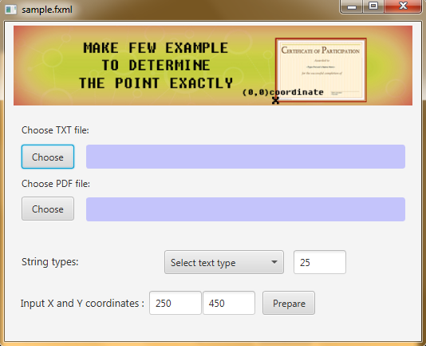
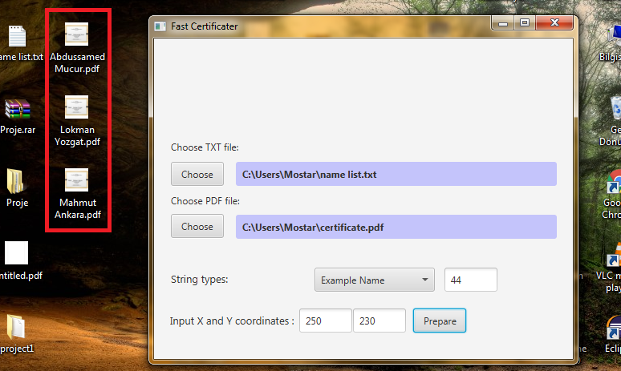
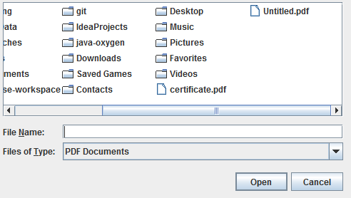
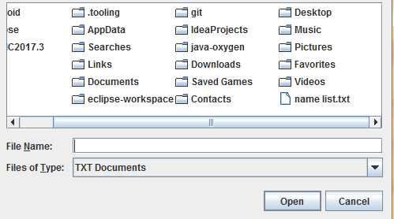
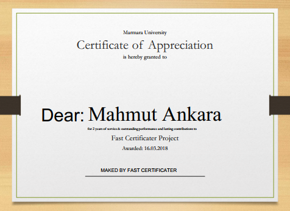

# Fast-Certificate
Creates PDFs with a table of name.

* Apache PDFBox Library used (version 2.0.8 .jar)
* Scene Builder 2.0 is used to implement the user interface

The image label doesn't work when run

